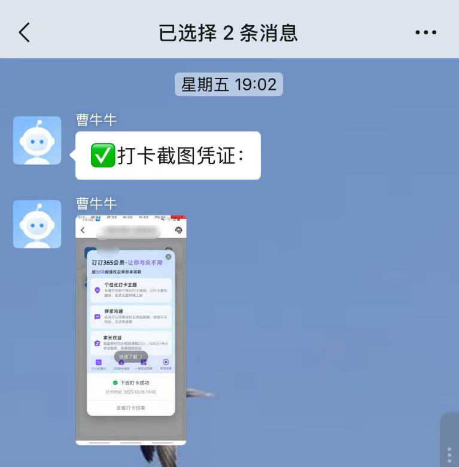

# ADB钉钉自动打卡脚本

一个基于ADB（Android Debug Bridge）的自动化脚本，用于自动完成钉钉考勤打卡操作，并将打卡截图发送到微信。



## 功能特性

- ✅ **工作日智能判断**：自动调用API判断当天是否为工作日，休息日自动跳过
- ✅ **随机延迟打卡**：支持随机延迟时间，避免每天同一时间打卡
- ✅ **自动设备检测**：检查ADB环境、设备连接状态和授权状态
- ✅ **屏幕自动唤醒**：自动检测并唤醒手机屏幕
- ✅ **自动启动钉钉**：自动打开钉钉应用并进入考勤打卡页面
- ✅ **自动打卡操作**：模拟点击操作完成打卡流程
- ✅ **自动截图保存**：以时间戳命名保存打卡截图，自动创建保存目录
- ✅ **企业微信通知**：自动将打卡截图发送到企业微信群
- ✅ **异常通知**：设备异常或API调用失败时自动发送错误通知
- ✅ **自动清理**：打卡完成后自动关闭应用和屏幕

## 环境要求

### 必需软件

1. **ADB工具**

   - 下载地址：[SDK 平台工具版本说明  |  Android Studio  |  Android Developers](https://developer.android.google.cn/tools/releases/platform-tools?hl=zh-cn)
   - 需要配置到系统环境变量PATH中，或使用ADB的绝对路径
   - 本项目中已包含adb工具，无需下载
2. **Windows系统**

   - Windows 10 或更高版本
   - PowerShell（系统自带）
3. **Android设备**

   - 已安装钉钉应用
   - 已开启USB调试模式
   - 通过USB或无线ADB连接到电脑

### 企业微信配置

需要配置企业微信群机器人Webhook地址：

1. 在企业微信群中添加机器人
2. 获取Webhook地址
3. 在脚本配置区填入Webhook地址

可以通过企业微信的微信插件，来实现在微信中查看企业微信的消息，这样我们就可以在微信中收到截图通知了，设置参看链接：[如何管理微信插件-帮助中心-企业微信](https://open.work.weixin.qq.com/help2/pc/18122)

### 网络要求

- 需要网络连接以调用工作日判断API（`https://timor.tech/api/holiday/info/`）
- 需要网络连接以发送企业微信通知

## 安装配置

### 1. 下载脚本

将本项目克隆到本地

### 2. 配置ADB

确保ADB已正确安装并配置到环境变量：

```bash
# 测试ADB是否可用
adb version
```

### 3. 连接设备

通过USB或无线ADB连接Android设备：

```bash
# 检查设备连接
adb devices
```

### 4. 配置脚本参数

编辑 `adb_auto_ding.bat` 文件，修改配置区参数：

```batch
:: ====================== 脚本配置区（可根据需要调整） ======================
:: 钉钉启动后等待加载的时间（秒），低端手机可适当增加（如8-10）
set "load_delay=6"
:: 企业微信Webhook地址（用于发送通知）
set "webhook_url=https://qyapi.weixin.qq.com/cgi-bin/webhook/send?key=YOUR_KEY"
:: 截图保存目录
set "screenshot_dir=D:\AutoDingCheck\screenshot"
:: 配置最大随机延迟时间（分钟），如5表示0-5分钟随机延迟
:: 防止每天同一时间打卡
set "max_random_delay_min=1"
:: =========================================================================
```

### 5. 调整点击坐标

根据你的手机屏幕尺寸和钉钉界面布局，调整以下坐标：

- 工作台按钮坐标：`adb shell input tap 468 2041`
- 考勤打卡按钮坐标：`adb shell input tap 145 885`
- 打卡按钮坐标： `adb shell input tap 548 1317`

**获取坐标方法：**

```bash
# 启用坐标显示（需要root权限）
adb shell settings put system pointer_location 1
```

或者在手指设置-开发者选项菜单中打开指针位置

## 使用方法

### 手动运行

双击运行 `adb_auto.bat` 文件，脚本将自动执行打卡流程。

### 定时任务（Windows任务计划程序）

1. 打开"任务计划程序"（Task Scheduler）
2. 创建基本任务
3. 设置触发器（如每天上午8:50）
4. 设置操作：启动程序选择 `adb_auto_ding.bat`
5. 完成配置

## 配置说明

| 配置项                   | 说明                           | 默认值     |
| ------------------------ | ------------------------------ | ---------- |
| `load_delay`           | 钉钉启动后等待加载的时间（秒） | 6          |
| `webhook_url`          | 企业微信机器人Webhook地址      | 需自行配置 |
| `max_random_delay_min` | 最大随机延迟时间（分钟）       | 1          |

**配置说明：**

- `load_delay`：根据手机性能调整，低端手机建议设置为8-10秒
- `webhook_url`：企业微信群机器人Webhook地址，用于接收打卡通知和错误通知
- `max_random_delay_min`：随机延迟时间范围（0到设定值分钟），用于避免每天同一时间打卡

## 工作流程

1. **工作日判断**

   - 获取当前日期
   - 调用工作日判断API（`https://timor.tech/api/holiday/info/`）
   - 判断是否为工作日（type.type=0为工作日）
   - 如果是休息日，显示节假日名称并退出
   - 如果API调用失败，发送错误通知并退出
2. **随机延迟**

   - 计算随机延迟时间（0到设定值分钟）
   - 显示倒计时
   - 等待随机延迟时间结束
3. **设备检查**

   - 检查ADB环境
   - 检查设备连接状态
   - 检查设备授权状态
   - 如异常，发送错误通知并退出
4. **屏幕唤醒**

   - 检查屏幕是否点亮（使用 `dumpsys deviceidle`）
   - 如未点亮，自动唤醒屏幕
5. **启动钉钉**

   - 清理钉钉后台进程
   - 启动钉钉应用
   - 等待应用加载完成
6. **执行打卡**

   - 点击工作台
   - 点击考勤打卡
   - 等待页面加载
   - 点击完成打卡
7. **截图保存**

   - 自动创建截图保存目录（如果不存在）
   - 截取屏幕
   - 以时间戳命名保存到本地
   - 格式：`YYYY-MM-DD_HH-MM-SS.png`
8. **发送通知**

   - 发送打卡成功文本消息
   - 发送打卡截图到企业微信群（开启微信插件可在微信中接受消息）
9. **清理工作**

   - 返回桌面（按Home键）
   - 关闭手机屏幕

## 注意事项

⚠️ **重要提示**

1. **工作日判断**：脚本会自动判断是否为工作日，休息日会自动跳过打卡。需要网络连接调用API接口
2. **随机延迟**：建议设置随机延迟时间（如1-5分钟），避免每天同一时间打卡，降低被识别风险
3. **坐标适配**：不同手机屏幕尺寸和钉钉版本，界面布局可能不同，需要根据实际情况调整点击坐标
4. **网络连接**：需要网络连接以调用工作日判断API和发送企业微信消息
5. **权限要求**：需要手机开启USB调试权限
6. **钉钉版本**：不同版本的钉钉应用，包名和Activity可能不同
7. **截图大小**：企业微信图片大小限制为2MB，如截图过大可能发送失败
8. **定时任务**：使用定时任务时，确保电脑在指定时间处于开机状态
9. **API依赖**：工作日判断依赖第三方API（`timor.tech`），如API不可用，脚本会发送错误通知并退出

## 故障排除

> 注意：使用本脚本清关闭钉钉的极速打卡功能。

### 问题1：ADB设备未连接

**解决方案：**

- 检查USB连接或无线ADB连接
- 确认手机已开启USB调试
- 在手机上确认USB调试授权弹窗

### 问题2：钉钉启动失败

**解决方案：**

- 确认手机已安装钉钉应用
- 检查钉钉包名是否正确（当前：`com.alibaba.android.rimet`）
- 尝试手动启动钉钉确认应用正常

### 问题3：点击坐标不准确

**解决方案：**

- 使用ADB命令获取实际坐标
- 根据手机屏幕尺寸重新计算坐标
- 考虑使用UI Automator等工具获取元素坐标

### 问题4：企业微信消息发送失败

**解决方案：**

- 检查网络连接
- 确认Webhook地址正确
- 检查截图文件大小（不超过2MB）
- 查看PowerShell错误信息

### 问题5：截图保存失败

**解决方案：**

- 脚本会自动创建截图保存目录，如仍失败请检查父目录权限
- 检查目录写入权限
- 确认手机存储空间充足

### 问题6：工作日判断失败

**解决方案：**

- 检查网络连接是否正常
- 确认API接口可访问（`https://timor.tech/api/holiday/info/`）
- 如API不可用，脚本会发送错误通知并退出
- 可以临时注释工作日判断代码，直接执行打卡流程

### 问题7：随机延迟不生效

**解决方案：**

- 确认 `max_random_delay_min`配置项已设置
- 检查脚本配置区是否正确配置
- 查看脚本输出的倒计时信息确认延迟是否执行

## 文件结构

```
adb/
├── adb_auto.bat          # 主脚本文件
├── README.md             # 说明文档
└── screenshot/           # 截图保存目录（自动创建）
    └── YYYY-MM-DD_HH-MM-SS.png
```

## 更新日志

### v1.1

- ✨ 新增工作日智能判断功能（使用API接口）
- ✨ 新增随机延迟功能，避免每天同一时间打卡
- ✨ 新增截图目录自动创建功能
- ✨ 改进屏幕唤醒检测逻辑
- ✨ 改进错误处理，API调用失败时发送通知
- 🔧 优化代码结构，添加更多调试信息
- 📝 更新文档说明

### v1.0

- 初始版本
- 支持自动打卡和截图
- 支持企业微信通知
- 支持异常通知

## 许可证

本项目仅供学习和个人使用，请遵守相关法律法规和公司规定。

## 贡献

欢迎提交Issue和Pull Request来改进本项目。

## 免责声明

本脚本仅供学习和研究使用，使用者需自行承担使用风险。请遵守公司考勤制度，不得用于任何违法违规用途。
